# AI Producer - Product Features & Agent Capabilities

## 1. 核心功能 (16 Core Functions / Skills)

基于目前的看板（Overview, Budget, Timeline, Assets）与项目资料（Brief、报价单、执行周期表），AI 制片（Agent）具备以下 16 项核心功能：

1. **`get_project_overview` (读取项目概览)**
   - **功能**: 获取客户信息、核心目标、整体制作周期与总预算。
   - **场景**: 老板询问“达梦那个项目现在基本情况是什么？”

2. **`get_budget_breakdown` (读取预算明细)**
   - **功能**: 获取前期筹备、拍摄执行、后期制作的具体费用拆解（Breakdown）及预算消耗水位。
   - **场景**: 老板询问“这30万预算是怎么花的？导演和摄影占了多少？”

3. **`modify_budget` (调整预算/记录超支)**
   - **功能**: 修改项目总预算或记录具体细项的超支/增加（如增加拍摄天数导致的费用上升）。
   - **场景**: 员工反馈“拍摄延期一天，超支了5000”，AI 自动记录并调整预算水位。

4. **`get_project_timeline` (读取排期与里程碑)**
   - **功能**: 获取项目当前的执行阶段（PPM、拍摄、后期等）、近期里程碑及预计交付时间。
   - **场景**: 老板询问“下周的排期是什么？什么时候能看到初剪？”

5. **`update_project_stage` (推进项目阶段)**
   - **功能**: 更新项目状态（planning -> shooting -> post_production）。
   - **场景**: 员工反馈“今天杀青了”，AI 自动将项目推进至“后期制作”阶段。

6. **`get_crew_info` (读取人员班底信息)**
   - **功能**: 获取当前项目分配的核心主创人员名单（导演、制片、摄影师等）及工作天数。
   - **场景**: 老板询问“这次达梦项目的导演是谁？定了拍几天？”

7. **`update_crew_assignment` (调整人员班底)**
   - **功能**: 更新人员安排或增减人员工作天数。
   - **场景**: 员工要求“把张导换成李导”，AI 进行人员替换登记。

8. **`get_assets_list` (读取资产/交付物列表)**
   - **功能**: 检查目前已经产出并归档的项目资产（如 Brief、脚本大纲、报价单、堪景照片等）。
   - **场景**: 老板询问“客户的 Brief 和最新报价单都在系统里了吗？”

9. **`add_project_asset` (提交/确认交付物)**
   - **功能**: 记录新的资产文件上传或确认阶段性交付物已完成。
   - **场景**: 员工说“脚本大纲已经发给客户了”，AI 将该节点标记为完成并记录资产。

10. **`transfer_message` (角色传话与任务派发)**
    - **功能**: 在老板与执行团队之间充当信息枢纽，主动发起会话或传达指令。
    - **场景**: 老板说“告诉张导明天开会”，AI 会主动向张导发消息。

11. **`ask_employee_schedule` (询问排期进度)**
    - **功能**: 向员工询问当前的排期进度与下一步计划。
    - **场景**: 老板说“问下张导排期怎么样了”。

12. **`ask_employee_risk` (询问项目风险)**
    - **功能**: 向员工询问目前项目的风险点或困难。
    - **场景**: 老板说“去了解下现在项目有什么风险”。

13. **`urge_employee_delivery` (催促员工交付)**
    - **功能**: 催促员工尽快完成并交付当前产出物。
    - **场景**: 老板说“催一下他们赶紧把初剪交了”。

14. **`provide_client_feedback` (转达客户反馈)**
    - **功能**: 向员工转达客户的修改意见或反馈。
    - **场景**: 老板说“告诉张导客户觉得颜色太暗了，让他调亮一点”。

15. **`schedule_internal_meeting` (安排内部会议)**
    - **功能**: 通知员工安排内部开会或堪景等日程。
    - **场景**: 老板说“通知他们明天下午3点开个进度会”。

16. **`report_to_boss` (向老板自然语言汇报)**
    - **功能**: 员工回复后，AI对内容进行自然语言处理并向老板汇报（附带员工原话在双引号内）。
    - **场景**: 员工回复后，AI自动给老板发消息：“老板，张导说：‘明天下午可以交片’”。

---

## 2. Agent 简明架构图 (Agent Architecture)

```mermaid
graph TD
    User["用户: 老板/员工"] <-->|"自然语言输入/输出"| Frontend["前端 Dashboard (React/Vite)"]
    
    Frontend <-->|"API/HTTP"| Backend["后端 API (FastAPI)"]
    
    subgraph AI_Producer_Agent ["AI 制片 Agent"]
        Router["意图路由 & 提示词引擎"]
        LLM["大语言模型 Model (e.g. Qwen2.5 / DeepSeek)"]
        
        Router -->|"1. 发送上下文 & Tools 定义"| LLM
        LLM -->|"2. 返回 Function Call 指令"| Executor["技能执行器 Skill Executor"]
        Executor -->|"3. 返回执行结果"| LLM
        LLM -->|"4. 生成最终人类语言"| Router
    end
    
    Backend <--> Router
    
    subgraph Skills ["Agent Skills / Functions"]
        S1["get_project_overview"]
        S2["get_budget_breakdown"]
        S3["modify_budget"]
        S4["get_project_timeline"]
        S5["update_project_stage"]
        S6["get_crew_info"]
        S7["update_crew_assignment"]
        S8["get_assets_list"]
        S9["add_project_asset"]
        S10["transfer_message"]
        S11["ask_employee_schedule"]
        S12["ask_employee_risk"]
        S13["urge_employee_delivery"]
        S14["provide_client_feedback"]
        S15["schedule_internal_meeting"]
        S16["report_to_boss"]
    end
    
    Executor -->|"调用对应的 Tool"| Skills
    
    subgraph Database ["SQLite DB / 状态存储"]
        DB_Proj[("Project Table")]
        DB_Budget[("Budget Breakdown")]
        DB_Crew[("Crew Table")]
        DB_Assets[("Assets Table")]
        DB_Msg[("Messages Table")]
    end
    
    Skills <-->|"读写数据"| Database
```

